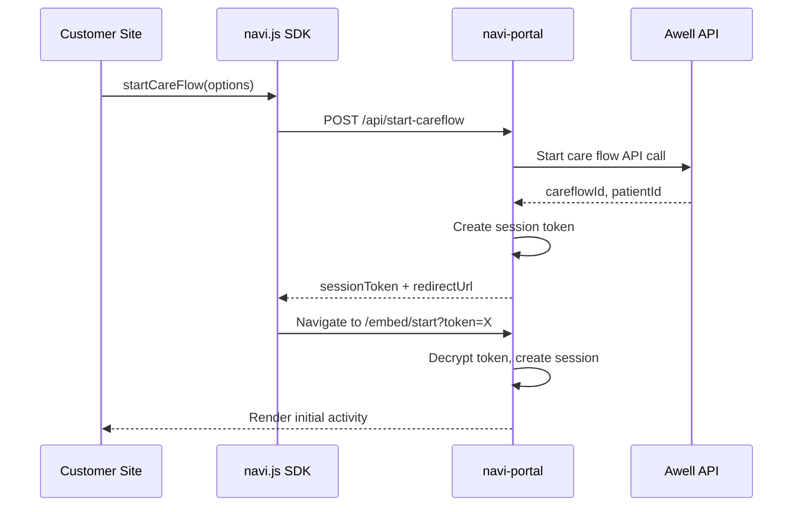
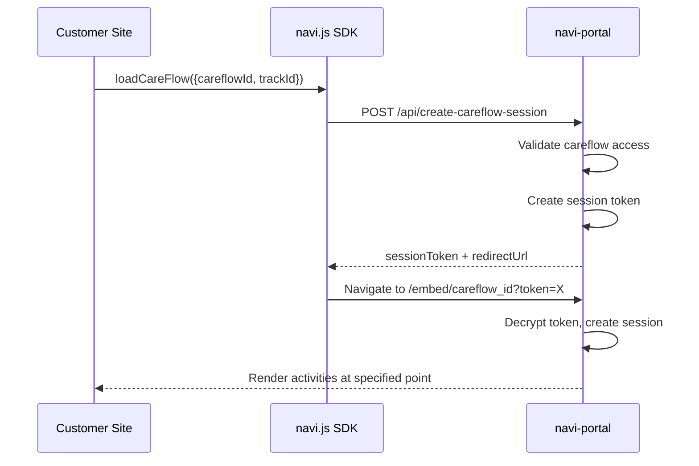

# Customer Use Case Implementation Analysis

## 📋 **Overview**

This document analyzes the customer use cases described in `CUSTOMER_USE_CASES.md` and provides a comprehensive implementation plan for the Navi SDK architecture.

### **Current State vs. Required State**

**Current Implementation:**

- SDK works with existing pathways/care flows only
- Requires pre-existing `pathwayId` and `stakeholderId`
- Magic link flow assumes care flow already exists
- Portal renders activities for running care flows

**Required Implementation:**

- SDK can start new care flows from definitions
- Support for anonymous and identified patient intake
- Portal can handle existing care flows with enhanced navigation
- Token-based linking for existing care flows

## 🎯 **Use Case Analysis**

### **Use Case 1: Starting a New Care Flow**

**1a. Anonymous Patient Intake**

```javascript
// Customer needs this capability
const navi = Navi("pk_test_customer_key");
navi.render("#container", {
  careflowDefinitionId: "cf_def_patient_intake",
});
```

**Requirements:**

- Only `publishableKey` + `careflowDefinitionId` needed
- Creates new anonymous patient automatically
- Starts new care flow instance
- Returns unique `careflowId` for the session

**1b. Identified Patient Intake**

```javascript
// Customer needs this capability
navi.render("#container", {
  careflowDefinitionId: "cf_def_patient_intake",
  patientIdentifier: {
    system: "https://customer.com/patient-ids",
    value: "patient_12345",
  },
});

// OR
navi.render("#container", {
  careflowDefinitionId: "cf_def_patient_intake",
  type: "identified",
  awellPatientId: "awell_patient_id",
});
```

**Requirements:**

- `publishableKey` + `careflowDefinitionId` + (FHIR patient identifier or awellPatientId)
- Links to existing patient or creates new one
- Associates care flow with customer's patient system

### **Use Case 2: Starting Portal for Existing Care Flow**

**Token-based Link Approach:**

```
https://customer-portal.com/navi?token=<encrypted_token>
```

**Direct Parameter Approach:**

```javascript
navi.render("#container", {
  careflowId: "cf_running_abc123",
  trackId: "track_optional_456", // optional granular control
  activityId: "activity_specific_789", // optional activity focus
});
```

## 🔧 **Technical Implementation Requirements**

### **1. SDK API Changes**

#### **navi.js Changes**

```typescript
// Unified interface - single render method
interface NaviInstance {
  render: (
    containerId: string,
    options: RenderOptions
  ) => Promise<NaviEmbedInstance>;
}

interface RenderOptions {
  // Use Case 1: Start new careflow
  careflowDefinitionId?: string;
  patientIdentifier?: {
    system: string;
    value: string;
  };
  awellPatientId?: string;

  // Use Case 2: Resume existing careflow
  careflowId?: string;
  careflowToken?: string; // Alternative to session creation
  trackId?: string;
  activityId?: string;

  // Common options
  branding?: BrandingConfig; // See apps/navi-portal/src/lib/branding/types.ts for interface
  stakeholderId?: string; // if included, the care session returned will include activities for that stakeholder, rather than for the patient
}
```

#### **navi-react Changes**

```typescript
// Unified React component with branding supplement support
<NaviProvider
  publishableKey="pk_test_key"
  branding={{
    primary: "#ff6b6b",
    logoUrl: "/test-logo.png",
    welcomeTitle: "Test Environment",
    // ... supplements organization branding
  }}
>
  {/* Use Case 1: Start new care flow */}
  <NaviEmbed
    careflowDefinitionId="cf_def_intake"
    onCareFlowStarted={(data) => console.log("Started:", data.careflowId)}
    onCompleted={(data) => console.log("Completed")}
  />

  {/* Use Case 2: Load existing care flow */}
  <NaviEmbed
    careflowId="cf_running_123"
    trackId="track_456"
    stakeholderId="care_coordinator_stakeholder_id"
    onActivityCompleted={(data) => console.log("Activity done")}
  />
</NaviProvider>
```

### **2. Backend API Changes**

#### **New navi-portal Endpoints**

**POST `/api/start-careflow`**

```typescript
interface StartCareFlowRequest {
  publishableKey: string;
  careflowDefinitionId: string;
  awellPatientId: string;
  patientIdentifier?: {
    system: string;
    value: string;
  };
  stakeholderId?: string;
}

interface StartCareFlowResponse {
  success: boolean;
  careflowId: string;
  patientId: string;
  sessionToken: string;
  redirectUrl: string;
  stakeholderId: string;
}
```

**POST `/api/create-careflow-session`**

```typescript
interface CreateCareFlowSessionRequest {
  publishableKey: string;
  careflowId: string;
  trackId?: string;
  activityId?: string;
  stakeholderId?: string;
}

interface CreateCareFlowSessionResponse {
  success: boolean;
  careflowId: string;
  patientId: string;
  sessionToken: string;
  redirectUrl: string;
  stakeholderId: string;
}
```

#### **Enhanced Portal Routes**

**Current:** `/embed/[pathway_id]`
**New routes needed:**

1. **`/embed/start`** - For new care flow creation
   - Accepts session token from care flow start API
   - Renders initial activity from newly created care flow
2. **`/embed/[careflow_id]`** - Enhanced existing care flow
   - Support `track_id` and `activity_id` query parameters
   - Navigate to specific points in care flow

### **3. Authentication Flow Updates**

#### **New Care Flow Creation Flow**



#### **Existing Care Flow Enhancement**



### **4. Environment & Configuration Changes**

```bash
CAREFLOW_CREATION_RATE_LIMIT=5 # 5/sec/organization to prevent abuse -- low priority feature during development phase
```

#### **Publishable Key Configuration**

```typescript
// Enhanced publishable key validation
interface PublishableKeyConfig {
  organizationId: string;
  allowedDomains: string[];
}
```

### **5. Security Enhancements**

#### **Access Control**

- Validate publishable key can only be used with certain origins
- Organization-scoped care flow access controls
- Rate limiting on care flow creation (prevent abuse)

#### **Data Validation**

- FHIR patient identifier format validation
- Care flow definition existence checks
- Cross-origin security for new endpoints

#### **Audit Logging**

```typescript
interface CareFlowAuditEvent {
  eventType: "careflow_created" | "careflow_loaded";
  organizationId: string;
  careflowId?: string;
  careflowDefinitionId?: string;
  stakeholderId?: string;
  timestamp: Date;
  userAgent: string;
  ipAddress: string;
}
```

### **6. Real-time Progress Updates via SSE**

#### **Enhanced Embed Experience**

The embed routes (`/embed/start` and `/embed/[careflow_id]`) should provide real-time progress updates using Server-Sent Events (SSE) for optimal user experience:

**Fast-Loading Branded Page:**

```typescript
// Fast branded loading page (< 1000ms FCP)
const html = `
<!DOCTYPE html>
<html>
<head>
  <title>${branding?.welcomeTitle || "Loading..."}</title>
  ${themeStyle} <!-- Inline CSS for instant theming -->
</head>
<body>
  <!-- Branded loading state -->
  <div class="loading-container">
    
    <h1>${branding?.welcomeTitle}</h1>
    <div class="progress-indicator">Preparing your care journey...</div>
  </div>
  
  <script>
    // Immediately start SSE connection for updates
    const eventSource = new EventSource('/api/careflow-status?token=${sessionToken}');
    eventSource.onmessage = (event) => {
      const update = JSON.parse(event.data);
      updateProgress(update);
    };
  </script>
</body>
</html>`;
```

**SSE Status Endpoint:**

```typescript
// New endpoint: GET /api/careflow-status
export async function GET(request: NextRequest) {
  const token = request.nextUrl.searchParams.get("token");

  // Set up SSE
  const stream = new ReadableStream({
    start(controller) {
      // Send progress updates
      const sendUpdate = (status: string, progress: number) => {
        controller.enqueue(`data: ${JSON.stringify({ status, progress })}\n\n`);
      };

      // Background careflow preparation
      prepareCareflow(token)
        .then(() => {
          sendUpdate("ready", 100);
          controller.close();
        })
        .catch((error) => {
          sendUpdate("error", 0);
          controller.close();
        });
    },
  });

  return new Response(stream, {
    headers: {
      "Content-Type": "text/event-stream",
      "Cache-Control": "no-cache",
      Connection: "keep-alive",
    },
  });
}
```

**Benefits:**

- **Sub-1000ms FCP**: Immediate branded page load
- **Real-time feedback**: Users see progress while backend prepares care flow
- **Error handling**: Graceful error states with retry mechanisms
- **Progressive enhancement**: Works without JavaScript, enhanced with SSE

## 📊 **Implementation Phases**

- [ ] Create `/api/start-careflow` endpoint
- [ ] Create `/api/create-careflow-session` endpoint
- [ ] Implement Awell API integration for care flow creation
- [ ] Add environment variable support
- [ ] Security and validation layer

- [ ] Update `/embed/start` route for new care flows
- [ ] Enhance `/embed/[careflow_id]` for existing care flows
- [ ] Add track_id and activity_id navigation support
- [ ] Update authentication flow handling

- [ ] Implement unified `render()` method in navi.js
- [ ] Add smart branching logic for different use cases
- [ ] Branding supplement support (BrandingConfig interface)
- [ ] Update iframe parameter handling
- [ ] Error handling and user feedback

- [ ] Update `<NaviEmbed>` component for unified API
- [ ] Add branding supplement support to `NaviProvider`
- [ ] Update TypeScript definitions with BrandingConfig interface
- [ ] Simplified component props matching unified API

- [ ] Integration testing across all use cases
- [ ] Update developer documentation
- [ ] Create migration guide
- [ ] Performance testing and optimization

## 🔄 **Migration Strategy**

### **Simplified Unified API**

✅ **Clean Single-Method Design**

- Single `render()` method handles all use cases
- Smart branching based on provided options
- Flexible branding supplement support
- Streamlined developer experience

### **Developer Migration Path**

```javascript
// Unified API - single render method handles all use cases
const navi = Navi("pk_test_key");

// Use Case 1a: Start new anonymous care flow
navi.render("#container", {
  careflowDefinitionId: "cf_def_intake",
});

// Use Case 1b: Start new identified care flow
navi.render("#container", {
  careflowDefinitionId: "cf_def_intake",
  patientIdentifier: {
    system: "https://customer.com/patients",
    value: "patient_123",
  },
});

// Use Case 2a: Load existing care flow with navigation
navi.render("#container", {
  careflowId: "cf_running_123",
  trackId: "track_456",
  activityId: "activity_789",
});

// Use Case 2b: Load existing care flow with navigation for stakeholder
navi.render("#container", {
  careflowId: "cf_running_123",
  stakeholderId: "stakeholder_123",
  trackId: "track_456",
  activityId: "activity_789",
});

// Branding supplement example
navi.render("#container", {
  careflowDefinitionId: "cf_def_intake",
  branding: {
    primary: "#ff6b6b",
    logoUrl: "/test-logo.png",
    welcomeTitle: "Test Environment",
    // ... supplements organization branding
  },
});
```

## 🎨 **Branding Supplement Details**

When `branding` is provided in options, it **supplements** the organization branding:

### **Supplement Behavior:**

```javascript
// Branding supplement - merges with org branding
navi.render("#container", {
  careflowDefinitionId: "cf_def_intake",
  branding: {
    primary: "#ff6b6b", // Overrides org primary
    logoUrl: "/test-logo.png", // Overrides org logo
    welcomeTitle: "Test Env", // Overrides org title
    // Other org branding properties remain unchanged
  },
});

// Without branding supplement - uses org branding only
navi.render("#container", {
  careflowDefinitionId: "cf_def_intake",
});
```

### **Benefits:**

- 🎨 **Selective customization** - override specific properties only
- 🧪 **Perfect for testing** - test with specific brand variations
- 🔧 **Environment overrides** - staging vs production themes
- 📱 **Component isolation** - test individual brand elements
- 🔄 **Maintains org defaults** - inherits organization foundation

### **Implementation:**

- Fetch organization branding from Edge Config first
- Merge provided `options.branding` on top of org branding
- Any provided properties override org equivalents
- Portal receives merged branding via iframe URL parameters
- Maintains organization's base theme with selective overrides

## 🚨 **Potential Challenges**

### **Technical Challenges**

1. **Cross-Domain Security**: Enhanced CORS and CSP policies for new endpoints
2. **Error Recovery**: Graceful handling when care flow creation fails

### **Product Challenges**

1. **Quota Management**: Preventing abuse of care flow creation
2. **Billing Integration**: Tracking and billing for dynamically created care flows
3. **Analytics**: Tracking conversion funnel from SDK usage to care flow completion

### **Operational Challenges**

1. **Monitoring**: New metrics for care flow creation success/failure rates
2. **Support**: Customer support for configuration and integration issues
3. **Documentation**: Comprehensive guides for both use cases

## 📈 **Success Metrics DRAFT**

Note: Don't worry about these metrics during the development phase.

### **Technical Metrics**

- Care flow creation API success rate (>99%)
- End-to-end latency for new flow creation (<2s)
- SDK bundle size impact (<5KB increase)
- Error rate for new endpoints (<1%)

### **Product Metrics**

- Customer adoption of new use cases
- Reduction in custom integration requests
- Time-to-integration for new customers
- Developer satisfaction scores

### **Business Metrics**

- Increase in care flow volume
- Reduction in support tickets for integration
- Customer retention and expansion
- Revenue attribution to self-service flows
