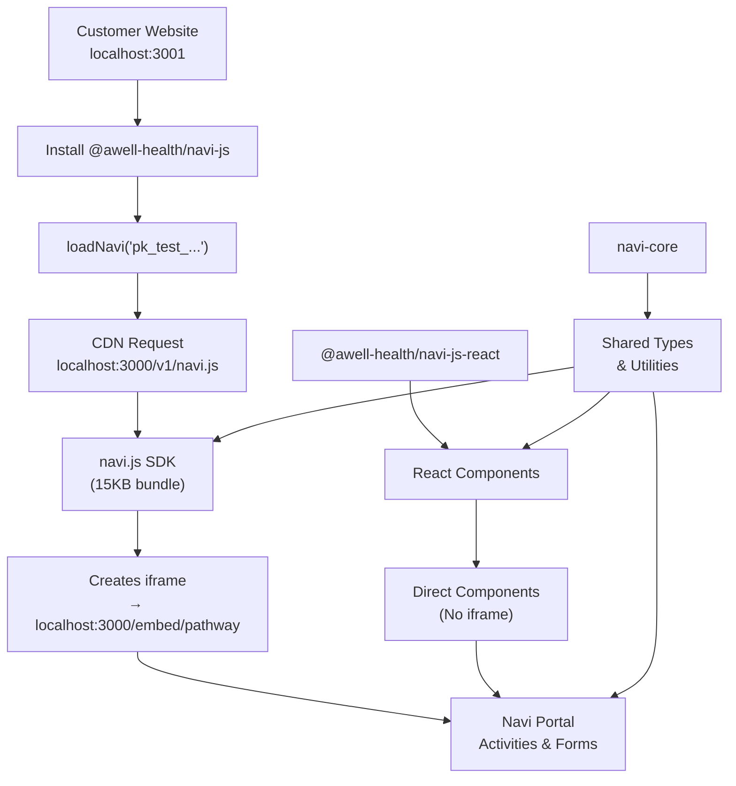

# Navi Monorepo

A monorepo for the Navi healthcare activities SDK, following a Stripe-like architecture for maximum security, performance, and developer experience.

**🚧 Development Status**: Currently in v0.x.x development phase - building toward v1.0.0 production release.

## 📚 Documentation

**Complete development and architecture documentation:**

- **[.cursorrules](./.cursorrules)** - AI agent guidelines and development rules
- **[API-CONTRACTS.md](./docs/API-CONTRACTS.md)** - Interface compatibility tracking and breaking change management
- **[RELEASE-PIPELINE.md](./docs/RELEASE-PIPELINE.md)** - Coordinated release procedures and deployment automation
- **[PACKAGE-GUIDELINES.md](./docs/PACKAGE-GUIDELINES.md)** - Package-specific development rules and standards
- **[REPOSITORY-STRATEGY.md](./docs/REPOSITORY-STRATEGY.md)** - High-level implementation strategy
- **[DEPLOYMENT-STRATEGY.md](./docs/DEPLOYMENT-STRATEGY.md)** - High level deployment strategy

> **For Developers**: Read `.cursorrules` for critical development guidelines and patterns.
> **For Architecture**: Review `API-CONTRACTS.md` and `REPOSITORY-STRATEGY.md` for system design.
> **For Releases**: Follow `RELEASE-PIPELINE.md` for deployment coordination.

## 🏗️ Architecture Overview

This monorepo implements a **CDN + NPM package** distribution model similar to Stripe.js:

### 🌐 CDN Distribution

- **`packages/navi.js/`** → Built and deployed to CDN (Google Cloud/Cloudflare/Vercel)
- **Global distribution** for optimal performance and caching
- **Version pinning** for predictable behavior

### 🔒 Embed Portal

- **`apps/navi-portal/`** → Deployed to Vercel as embed-only content
- **Cross-origin iframes** for security and compliance
- **Isolated rendering** of healthcare activities

### 📦 NPM Packages

- **`packages/navi-js/`** → Wrapper package that loads CDN script (like `@stripe/stripe-js`)
- **`packages/navi-react/`** → React components and hooks for direct integration
- **`packages/navi-core/`** → Shared utilities, types, and services

### 🧪 Development & Testing

- **`examples/test-integration/`** → Integration testing app for both SDK patterns
- **Cross-origin testing** between localhost:3001 (customer) and localhost:3000 (embed)

## 🚀 Distribution Strategy

### **Production Deployment**

```
🌐 CDN: https://cdn.navi.com
└── /v1/navi.js                 ← JavaScript SDK

🔒 Embed: https://embed.navi.com
└── /[pathway_id]               ← Iframe content

📦 NPM: @awell-health/navi-js
└── Loads CDN script securely
```

### **Development Environment**

```
🏢 Portal: localhost:3000
├── /navi.js                    ← Development SDK
└── /embed/[pathway_id]         ← Iframe content

🧪 Test App: localhost:3001
└── Tests both SDK integration patterns
```

## 📦 Package Responsibilities

### `@awell-health/navi-js`

NPM wrapper package that securely loads the Navi SDK from CDN. Provides TypeScript types and a clean loading interface, similar to how `@stripe/stripe-js` works.

### `@awell-health/navi-react`

React components for customers who want to embed Navi activities directly into their React applications instead of using iframes.

### `@awell-health/navi-core`

Shared utilities, TypeScript types, authentication services, and common functionality used across the SDK packages.

### `navi.js` (CDN Bundle)

The main JavaScript SDK that gets distributed via CDN. Creates secure cross-origin iframes and handles all communication with the Navi embed portal.

### `navi-portal` (Embed Application)

Vercel-deployed application that renders healthcare activities inside secure iframes. Handles JWT authentication, branding, and activity rendering.

## 🛠️ Development

### Prerequisites

- Node.js 22+
- pnpm package manager

### Quick Start

```bash
# Install dependencies
pnpm install

# Build all packages
pnpm build

# Start development servers
pnpm dev
```

This starts both the portal (localhost:3000) and test integration app (localhost:3001) to test cross-origin iframe functionality.

### Package Development

```bash
# Build packages only
pnpm build:packages

# Test specific package
pnpm --filter navi-react test

# Lint all code
pnpm lint
```

## 🌍 Deployment Targets

- **CDN**: Google Cloud CDN, Cloudflare, or Vercel Edge Network
- **Portal**: Vercel (embed.navi.com)
- **NPM**: Public registry for customer installation

## 📁 Workspace Structure

```
navi/
├── apps/
│   └── navi-portal/              # Embed portal (Vercel deployment)
├── packages/
│   ├── navi-js/                  # NPM wrapper (loads CDN)
│   ├── navi.js/                  # JavaScript SDK (CDN bundle)
│   ├── navi-react/               # React components (NPM)
│   └── navi-core/                # Shared utilities (NPM)
├── examples/
│   └── test-integration/         # Cross-origin testing app
└── requirements/                 # Architecture & API documentation
```



## 🔄 Release Management

Uses [Changesets](https://github.com/changesets/changesets) for coordinated package versioning:

```bash
pnpm changeset           # Add changeset
pnpm changeset:version   # Update versions
pnpm changeset:publish   # Publish to NPM
```

CDN deployment happens automatically via GitHub Actions when tags are pushed.

## 🎯 Design Goals

- **Security**: Cannot bundle or self-host (like Stripe's PCI compliance model)
- **Performance**: Global CDN distribution with aggressive caching
- **Developer Experience**: Clean APIs with full TypeScript support
- **Reliability**: Version pinning and backward compatibility
- **Compliance**: HIPAA-aligned architecture for healthcare data

## 📄 License

MIT

## 🤝 Contributing

1. Fork the repository
2. Create feature branch (`git checkout -b feature/name`)
3. Commit changes (`git commit -m 'Description'`)
4. Push branch (`git push origin feature/name`)
5. Open Pull Request

## 📞 Support

For questions or issues, please open a GitHub issue or contact the Awell Health team.
