# Navi - Patient Portal Prototype

A high-performance patient portal built with Next.js 15, designed for sub-second load times and seamless care flow management.

## 🏗️ Architecture & User Flow

```mermaid
sequenceDiagram
    participant U as User
    participant E as Edge Runtime (Vercel Edge)
    participant C as Branding Cache (In-Memory)
    participant A as Auth Service (JWT)
    participant API as Awell API (M2M/Orchestration)
    
    Note over U,API: 🎯 Performance Goal: <1s paint time
    
    U->>E: 1. Click encrypted link (careflow/patient/org data)
    Note right of U: Link contains encrypted: Care flow ID, Patient ID, Organization ID
    
    E->>E: 2. Decrypt link parameters
    Note right of E: ⚡ Edge Runtime Expected: <100ms
    
    E->>C: 3. Fetch org branding
    C-->>E: Branding settings
    Note right of C: 🔧 PROTOTYPE In-memory cache PROD: Distributed cache
    
    alt Landing Page Flow (Optional)
        E->>U: 4a. Render landing page with org branding
        Note right of E: 🎯 Target: <1000ms FCP
        U->>E: 5a. User interaction (continue/start)
    else Direct Redirect Flow
        Note over E: 4b. Skip landing page (configurable)
    end
    
    E->>A: 6. Create session JWT
    A-->>E: JWT token + session
    Note right of A: 🔒 Session includes: Patient context, Org permissions, Expiry
    
    E->>U: 7. Redirect to activities /careflows/[id]/stakeholders/[id]
    Note right of E: ⚡ Client-side navigation with JWT in session
    
    U->>E: 8. Load activities page
    
    rect rgb(255, 240, 240)
        Note over E,API: 🔧 CURRENT PROTOTYPE STATE
        E->>API: 9. M2M API call (API key auth)
        Note right of API: ⚠️ Limited to 'awell-dev' organization only
        API-->>E: Activities data
    end
    
    rect rgb(240, 255, 240)
        Note over E,API: 🚀 FUTURE PRODUCTION STATE
        Note right of API: JWT-validated requests ✅ Any tenant supported ✅ Proper user context
    end
    
    E->>U: 10. Render activities UI with Apollo Client
    Note right of E: 📊 Generated GraphQL types 🎨 Org-specific theming
    
    Note over U,API: 🏗️ Architecture Notes: Edge runtime for global speed, JWT for secure session management, GraphQL for type-safe data fetching, Configurable landing page flow
```



## 🚀 Key Features

- **⚡ Edge Runtime**: Sub-second page loads with global edge deployment
- **🔒 Secure Authentication**: JWT-based session management with encrypted links
- **🎨 Dynamic Theming**: Organization-specific branding with real-time theme switching
- **📊 Type-Safe GraphQL**: Apollo Client with auto-generated TypeScript types
- **📱 Mobile-First**: Optimized for mobile devices with WCAG 2.1 AA accessibility
- **🔧 Configurable Flows**: Optional landing pages and customizable user journeys

## 🛠️ Tech Stack

- **Framework**: Next.js 15 with App Router and Turbopack
- **Runtime**: Vercel Edge Runtime for global performance
- **GraphQL**: Apollo Client with GraphQL Code Generator
- **Styling**: Tailwind CSS v4 with dynamic theming
- **Auth**: JWT with encrypted URL parameters
- **Testing**: Vitest with React Testing Library
- **Performance**: Lighthouse CI with performance budgets

## 🗄️ Data Storage Strategy

### Vercel Edge Config vs KV

This project uses **both** Vercel Edge Config and Vercel KV for different purposes:

| Service | **Vercel Edge Config** | **Vercel KV** |
|---------|------------------------|---------------|
| **Purpose** | Read-only configuration | Read-write caching |
| **Latency** | <50ms (edge-replicated) | ~100-200ms (single region) |
| **Updates** | Deploy-time only | Real-time programmatic |
| **Best For** | Static configs, branding | Sessions, dynamic cache |

#### Current Usage:
- **Edge Config**: Organization branding configurations (logos, colors, themes)
- **KV**: Not yet implemented (planned for session management and API caching)

#### Why Both?
- **Edge Config** gives us ultra-fast branding lookups for sub-1000ms FCP goals
- **KV** will handle dynamic data like user sessions and API response caching
- Different tools for different performance and consistency requirements

## 🏃‍♂️ Getting Started

### Prerequisites

- Node.js 22+ (see `.nvmrc`)
- pnpm (package manager)

### Installation

```bash
# Clone the repository
git clone <repository-url>
cd navi

# Install dependencies
pnpm install

# Set up environment variables
cp .env.example .env
# Edit .env with your API keys and configuration

# Generate GraphQL types
pnpm codegen

# Start development server
pnpm dev --turbopack
```

### Environment Variables

```env
PROTOTYPE_API_KEY=your_awell_api_key
NEXT_PUBLIC_ENCRYPTION_SECRET=your_encryption_secret
```

## 📋 Available Scripts

- `pnpm dev` - Start development server with Turbopack
- `pnpm build` - Build for production (includes GraphQL codegen)
- `pnpm codegen` - Generate GraphQL types and hooks
- `pnpm codegen:watch` - Watch mode for GraphQL generation
- `pnpm test` - Run tests with Vitest
- `pnpm test:performance` - Run performance tests
- `pnpm lint` - Run ESLint

## 🔧 Development Status

### ✅ Production Ready
- Next.js 15 App Router with Edge Runtime
- Apollo Client with type-safe GraphQL
- Dynamic theming system
- JWT authentication
- Performance optimization
- Accessibility compliance (WCAG 2.1 AA)

### 🔧 Prototype/In Development
- **Branding Cache**: Currently in-memory, needs distributed cache
- **API Authentication**: M2M with API key (limited to 'awell-dev' org)
- **Tenant Support**: Single organization, needs multi-tenant support

### 🚀 Future Production Goals
- JWT-validated API requests for any tenant
- Distributed branding cache
- Enhanced analytics and monitoring
- Advanced error handling and fallbacks

## 📊 Performance Goals

- **First Contentful Paint**: < 1000ms on 4G mobile
- **Time to Interactive**: < 2500ms
- **Bundle Size**: 15KB initial, 40KB per chunk
- **Edge Processing**: < 100ms

## 🏗️ Architecture Decisions

- **Edge Runtime**: For global speed and reduced latency
- **GraphQL Fragments**: Reusable, composable data fetching
- **Apollo Client**: Caching and optimistic updates
- **Tailwind v4**: Dynamic theming with CSS variables
- **TypeScript Strict**: Full type safety across the stack

## 🤝 Contributing

1. Fork the repository
2. Create a feature branch
3. Make your changes with tests
4. Run performance and accessibility checks
5. Submit a pull request

## 📄 License

[License details here]
