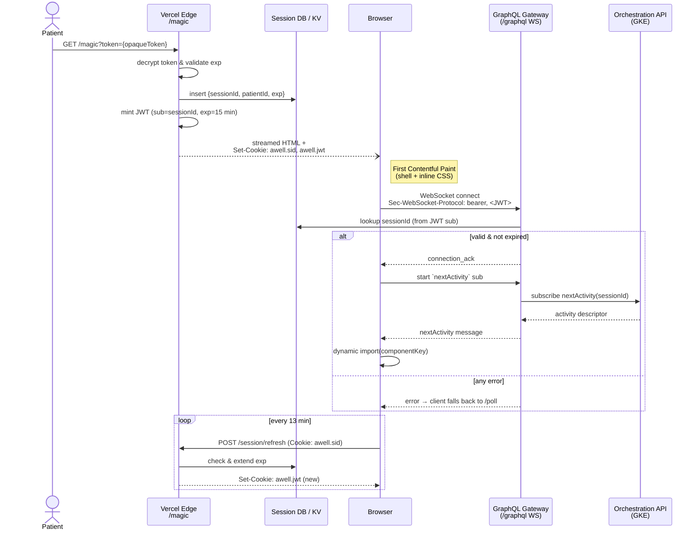

# Authentication & Session Management

## 1. Magic-Link Flow

1. Patient clicks a link of shape  
   `https://<customer-domain>/magic?token=<opaqueToken>`
2. Edge Function `GET /magic`:
   - Decrypts token → `{patientId, careflowId, exp}`.
   - Inserts a `sessions` row: `sessionId`, `patientId`, `expiresAt`.
   - Generates **JWT**: `sub=sessionId`, `exp ≤ 15 min`.
   - Sets cookies
     - `awell.sid` – opaque sessionId, HttpOnly, SameSite=Lax, Secure, Domain=`customer-domain`
     - `awell.jwt` – JWT, HttpOnly, SameSite=Lax, Secure, Path=`/graphql`
   - Streams initial HTML shell (activity arrives later via subscription).

## 2. Token Refresh

- Background XHR to `/session/refresh` 2 min before expiry.  
  Returns new JWT and resets expiry cookies.

## 3. Security Requirements

- AES-GCM 256 for token encryption.
- No identifiers (sessionId, patientId) may appear in query strings after first redirect.
- Referrer-Policy: `strict-origin`.

## 4. Multi-domain Support

- Each customer provides CNAME → Vercel project.
- Edge function detects host header, looks up `orgId`, applies correct branding, i18n default, and cookie domain.

